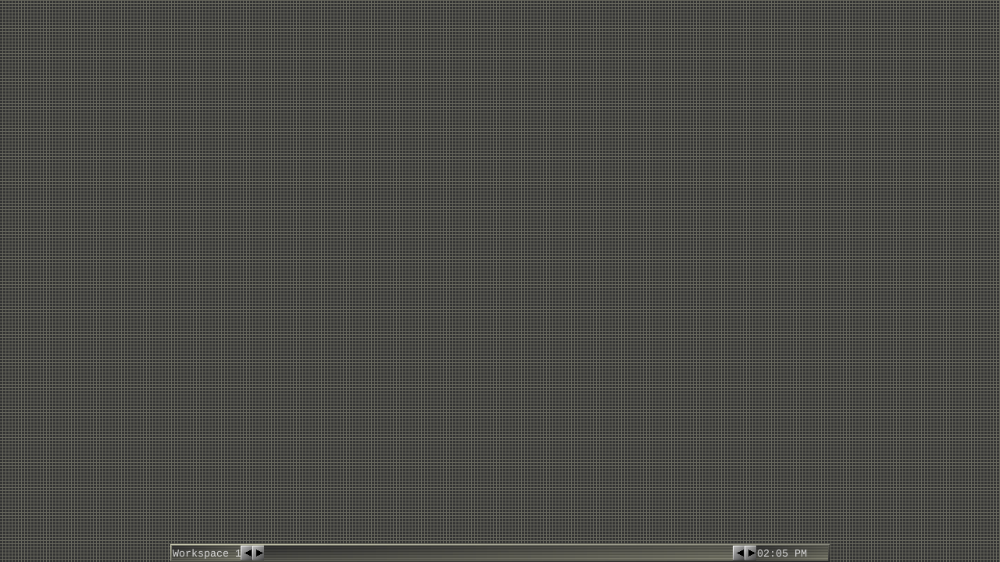
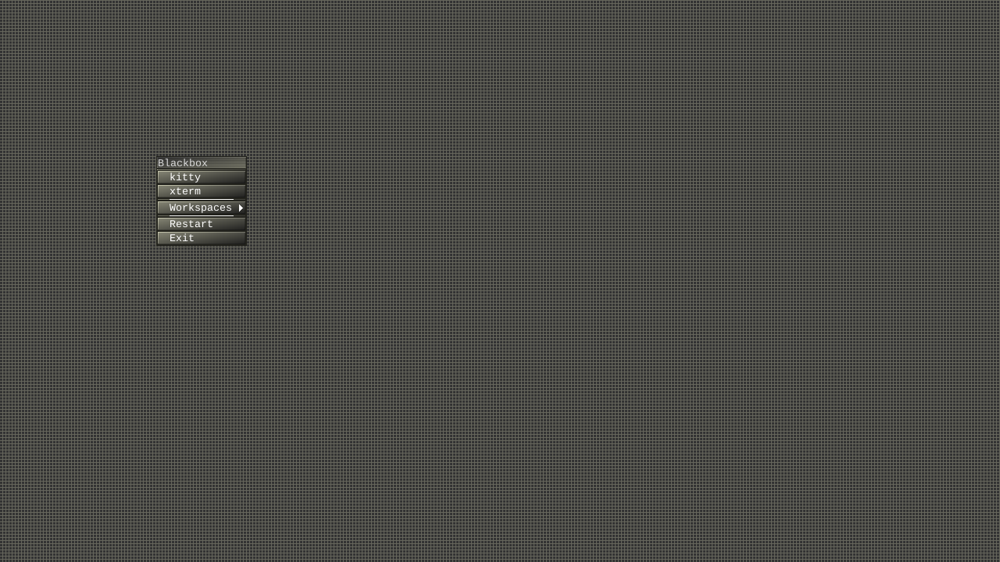
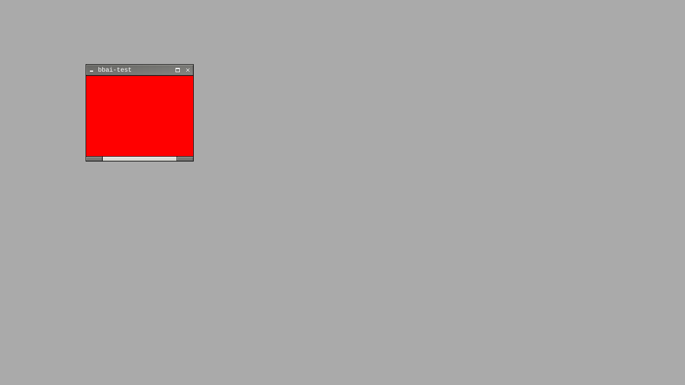
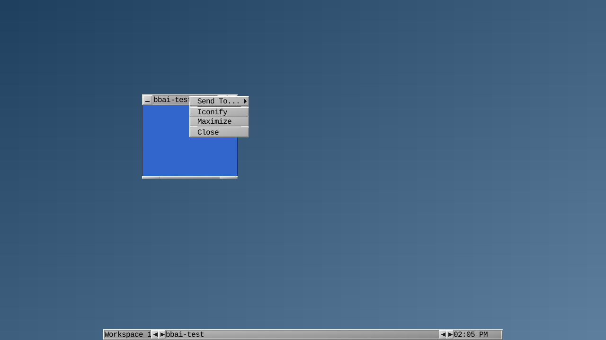
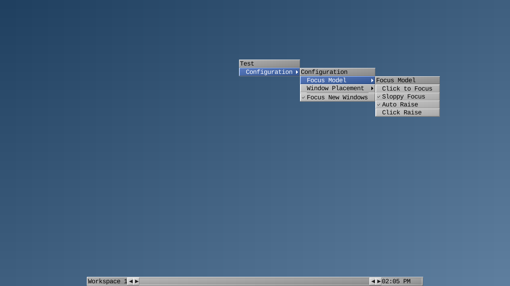
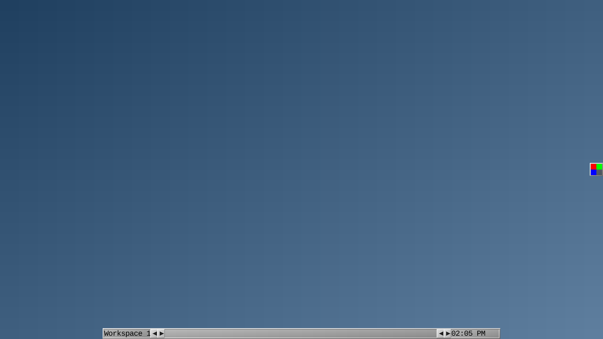

# BlackboxAI

The Blackbox window manager, reborn as a Wayland compositor.


BlackboxAI is a from-scratch wlroots 0.20 compositor written in C++20 - not an
X11 port. It reads your original `.blackboxrc`, style files, and menu files
unchanged and renders the same toolbar, menus, workspaces, and slit. This is a
pure-Wayland v1: there is no XWayland yet, so X11-only applications do not run
(see [Limitations](#limitations-and-non-goals)).

## Gallery

These are headless golden renders - pixman, a bundled mono font, fixed geometry.
They are representative of the layout and theming, not glamour shots.

| | |
| --- | --- |
|  The default `Results` style. |  The toolbar: workspace label, focused window, clock. |
|  The root menu (right-click the desktop). |  Server-side titlebar, handle, and resize grips. |
|  Per-window operations. |  The live Configuration menu. |
|  A fullscreen window. |  The slit hosting a StatusNotifierItem tray icon. |

## It's your Blackbox config

Point `session.styleFile` and `session.menuFile` in `~/.blackboxrc` at your
classic files and they load as-is.

The 19 original styles ship bundled: `Artwiz`, `Blue`, `Cthulhain`, `Flux`,
`Gray`, `Green`, `Minimal`, `Nyz`, `Operation`, `Outcomes`, `Purple`, `Rampage`,
`Rancor`, `Red`, `Results`, `Shade`, `Spiff`, `TDF`, `Twice`. The default is
`Results` - chosen over `Gray` because `Gray` leans on wildcard X-resource
lookups and `Parent_Relative` copying that this build does not reproduce. Style
files that set a themed root background are honored natively: the classic
`bsetroot` gradient/solid syntax is interpreted directly, no external tool.

Menu files load unchanged, with one exception: pipe menus (`[include] |cmd`) are
not supported and are skipped with a diagnostic rather than silently, because
reading a subprocess at menu-open would stall the compositor loop.

One deliberate asymmetry around `rootCommand`: a `rootCommand` in `~/.blackboxrc`
is run through `/bin/sh`, but a `rootCommand` in a *style* file never reaches a
shell. A downloaded theme should not be able to run arbitrary commands.

## Keybindings

The table below is the default set. To change it, copy the shipped
`/usr/share/blackboxai/keys` to `~/.blackboxai/keys` and edit, or point
`session.keyFile` in `~/.blackboxrc` at a file of your own. A keys file is
authoritative (fluxbox-style: it *replaces* the defaults), one binding per line
`<modifiers> <key> :<Action> [args]`. `Ctrl+Alt+BackSpace` is reserved as the
emergency quit and always works. Beyond the built-in actions, `:Exec <command>`
binds a key to launch a program. See `man blackboxai` for the full grammar.

| Keys | Action |
| --- | --- |
| `Super+Right` / `Super+Left` | Next / previous workspace |
| `Super+1` .. `Super+4` | Go to workspace 1-4 |
| `Super+Space` | Open the root menu |
| `Super+Q` | Close the focused window |
| `Alt+Tab` / `Alt+Shift+Tab` | Cycle windows most-recently-used (also `Super+Tab` / `Super+Shift+Tab`) |
| `Super+Alt+T` | Icon menu (iconified windows) |
| `Super+F7` | Screenshot a region to the clipboard |
| `Ctrl+Alt+Backspace` | Quit the compositor (escape a wedged session) |
| `Super+F` | Toggle fullscreen |
| `Super+Shift+Left` / `Super+Shift+Right` | Snap the window to the left / right half |
| `Super+Ctrl+Left/Right/Up/Down` | Move the window to the output in that direction |

## Configuration

Two layers.

**The live Configuration menu** (right-click the desktop, then Configuration).
Toggling an entry applies it immediately and writes that one key back to
`~/.blackboxrc` in place: focus model (Sloppy / ClickToFocus), auto-raise,
click-raise, focus-new-windows, window placement (RowSmart / ColSmart / Center /
Cascade), toolbar enable / placement / auto-hide, and slit placement / direction
/ auto-hide.

**`~/.blackboxrc` keys** for the rest: `session.styleFile`, `session.menuFile`,
`rootCommand`, workspace count (default 4) and names, `session.doubleClickInterval`
(250 ms), `session.autoRaiseDelay` (400 ms), mouse-wheel workspace and toolbar
switching (both on by default), and `session.screenN.strftimeFormat` for the
toolbar clock, applied live. The default focus model is `SloppyFocus`
(focus-follows-mouse), on by default.

Workspaces are exported over the `ext-workspace-v1` protocol, so an external
panel or pager that speaks it sees the workspace set. Switching from within
BlackboxAI is by `Super+arrow`, `Super+1..4`, or the toolbar.

## Install

Fedora 44 only - the wlroots 0.20 pin resolves on no other distribution release
today. Full details in [docs/install.md](docs/install.md).

From the COPR:

```
sudo dnf copr enable hila-shemer/blackboxai
sudo dnf install blackboxai
```

Then log out and pick **BlackboxAI** at your GDM greeter
([docs/gdm-session.md](docs/gdm-session.md)). Or build from source with the
`blackboxai-ci:f44` container or a Fedora-44 host - see
[docs/install.md](docs/install.md).

## Limitations and non-goals

Named honestly, each with its reason:

- **No XWayland.** This is a pure-Wayland v1; X11-only applications do not run
  (deferred).
- **No window shade.** The xdg-shell protocol has no shade concept. (The bundled
  `Shade` style is a theme name, not the feature.)
- **The slit is a tray, not a dock.** It hosts StatusNotifierItem tray icons over
  D-Bus, not X11 XEMBED dockapps.
- **Tray context menus are text-only** - no icon column.
- **`[restart]` and `[exit]` take every client with them.** The compositor is the
  display server, so there is no separate X server to outlive the windows.
- **`toolbar.onTop` / `slit.onTop` are inert** - read from the rc file, but there
  is no menu toggle and no restack, so no lying toggle is shown.
- **Workspace count is grow-only** on a live reconfigure.
- **The screen locker is external** - locking and idle are protocol-only
  (`ext-session-lock-v1` + `ext-idle-notify-v1`); pair it with `swaylock` /
  `swayidle`.

## Build and license

BlackboxAI is a rewrite in the style of the bbidulock/blackboxwm line of
Blackbox; the `bt::` gradient and texture math is ported closely from it. The
design specs live under [docs/superpowers/specs/](docs/superpowers/specs/), and
`man blackboxai` documents the resource keys, menu grammar, and keybindings.

MIT licensed - see [LICENSE](LICENSE).
